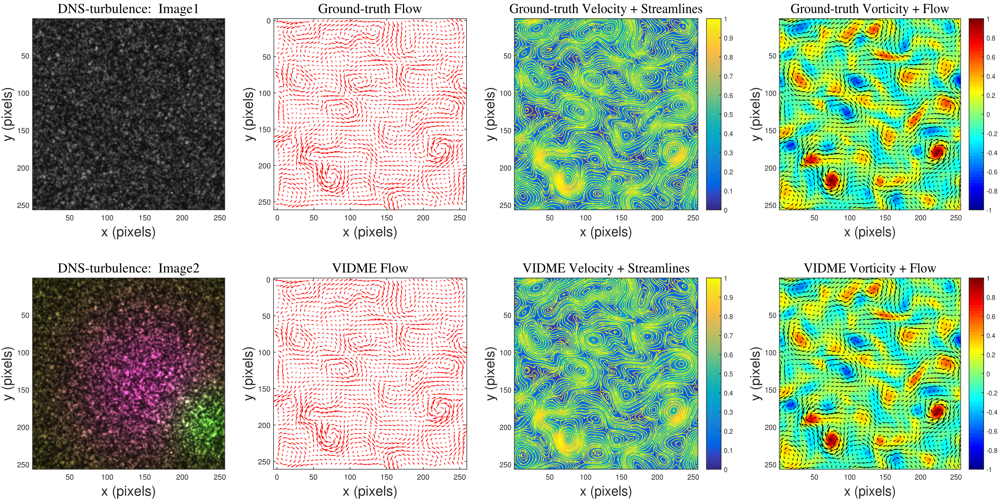

# VIDME
This repository contains the source code for our paper:

[VIDME: Flow Visualization for Complex Fluid Flows via A Variation Inspired Deep Motion Estimator]<br/>
Submitted to IEEE Transactions on Image Processing <br/>
Jun Chen, Xiaoyin He, He Wang, Guangguang Yang, Zemin Cai, Zhifeng Hao, and Tianshu Liu<br/>



## Environments
You will have to choose cudatoolkit version to match your compute environment. 
The code is tested on PyTorch 1.8.0 but other versions might also work. 
```Shell
conda create --name vidme python==3.7
conda activate vidme
conda install pytorch=1.8.0 torchvision=0.9.0 cudatoolkit=11.1 -c pytorch -c conda-forge
pip install matplotlib imageio einops scipy opencv-python
```
## Demos
You can demo a trained model on a sequence of frames
```Shell
python demo.py --model=models/piv_particle_vidme.pth --path=demo-frames

```

## Training
If you have a Nvidia RTX GPU, training can be accelerated using mixed precision. You can expect similiar results in this setting (1 GPU)
```Shell
./train_Particle_mixed.sh

```
Or execute the following command：
```Shell
python -u train.py --name piv_particle_vidme --stage particle --validation particle --gpus 0 --num_steps 410000 --batch_size 8 --lr 0.000125 --image_size 256 256 --wdecay 0.0001 --mixed_precision

```
## Required Data

By default `datasets.py` will search for the datasets in these locations. You can create symbolic links to wherever the datasets were downloaded in the `datasets` folder

```Shell
├── datasets
    ├── Sintel
        ├── test
        ├── training
    ├── Particle
        ├── testing
            ├── PIV_datasets_test_image
            ├── PIV_datasets_test_flow
            ├── PIV_datasets_test_flowpng
            ├── Analytics_Particle_testing
            ├── Analytics_Flow_testing
            ├── Analytics_Flowpng_testing
        ├── training
            ├── PIV_datasets_training_image
            ├── PIV_datasets_training_flow
            ├── PIV_datasets_training_flowpng
            ├── Analytics_Particle_training
            ├── Analytics_Flow_training
            ├── Analytics_Flowpng_training
    ├── FlyingChairs_release
        ├── data

```


